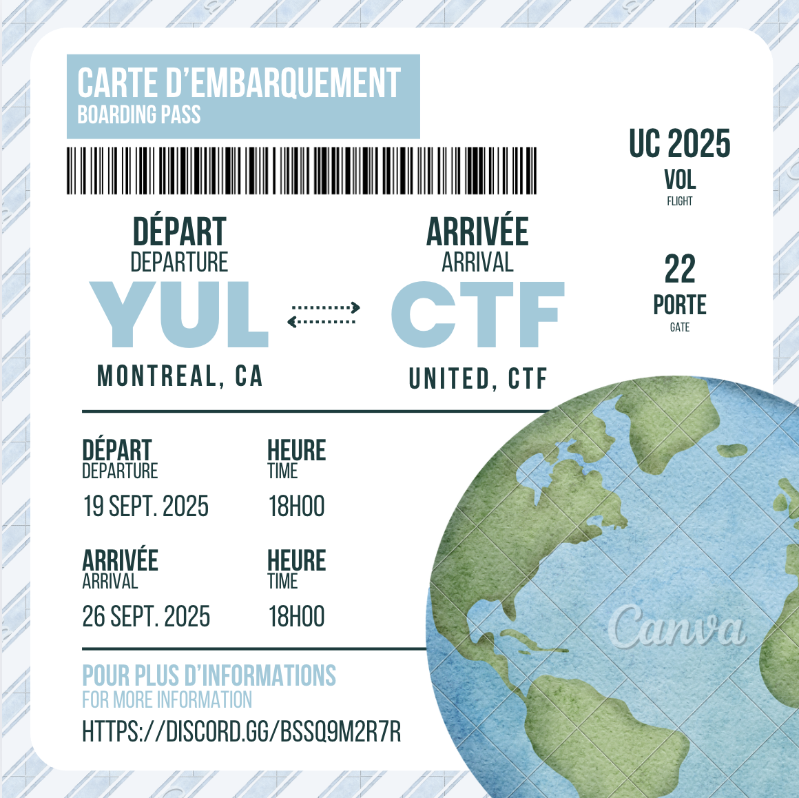

# Influenceur 1

## Write-up

Le défi ne nous indique pas grand chose, mais nous pouvons quand même trouver quelques indices. 
1. Le nom du challenge, 'Influenceur'. On peut donc s'attendre à quelque chose en rapport avec les réseaux sociaux.
2. L'allusion à une biographie Intsgram.
3. La mention du 'tout premier billet d'avion', à destination de 'CTF'

Grâce à tous ces indices, on comprend qu'il sagit du premier post de l'édtion de cette année, dont je n'ai pas encore l'URL. Voici la publication en question:

En prenant une capture d'écran u code barre, on peut ensuite l'uploader sur un [site de décodage](https://products.aspose.app/barcode/recognize/code128) de code barre, et obtenir le flag ainsi:

## Flag

`flag-b3tt3r_tak3_y0ur_5ungla5535`
