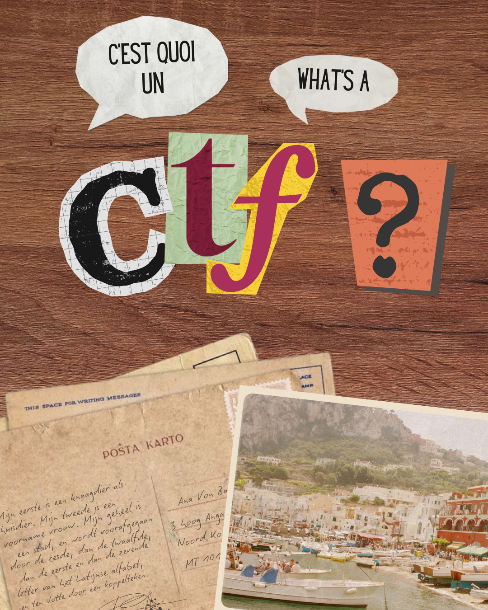

# Influenceur 2

## Write-up

Suite à la première solution, nous pouvons nous attendre à ce que cette track se poursuive sur les posts des réseaux sociaux. 
La description fait référence à une carte postale, comme la deuxième publication de cette édition:



La carte postale contient en fait une charade en hollandais :

```
Mijn eerste is een knaagdier als
huisdier. Mijn tweede is een
voorname vrouw. Mijn geheel is
een stad, en wordt voorafgegaan
door de zesde, dan de twaalfde,
dan de eerste en dan de zevende
letter van het Latijnse alfabet,
gevolgd door een koppelteken.
```

Si on traduit le tout avec Google Traduction, on trouve 

```
Mon premier nom est un rongeur domestique. Mon deuxième nom est une femme de distinction. Mon tout est une ville, précédée de la sixième, puis de la douzième, puis de la première, puis de la septième lettre de l'alphabet latin, et enfin d'un trait d'union.
```

Le premier est un hasmter (hamster aussi en anglais).
Le deuxième est une dame (dame aussi en anglais).
Le tout est donc la ville d'Amsterdam, précédé de `flag-`.

## Flag

`flag-Amsterdam`
