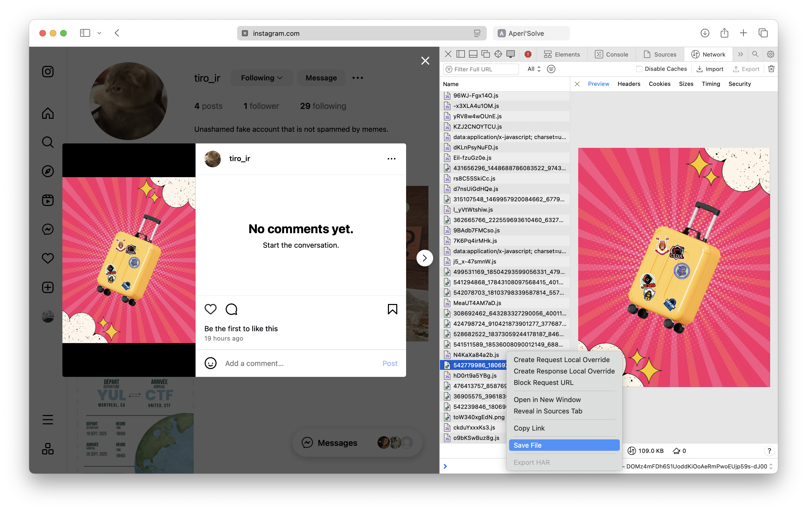
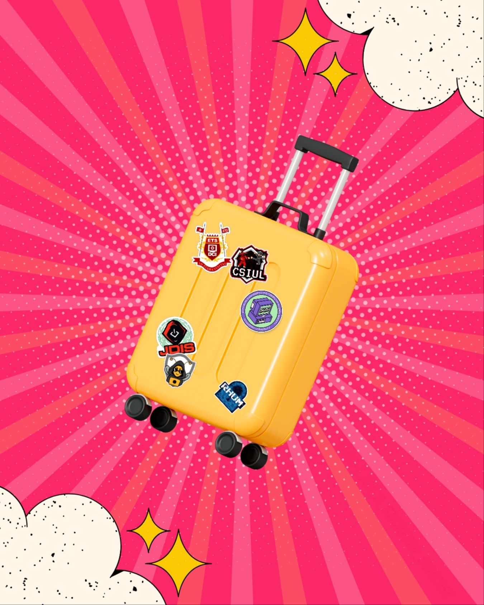

# Influenceur 3

## Write-up

By now, on a compris que ces challenges se déroulent sur les publications postées sur les réseaux sociaux du UnitedCTF. C'est d'autant plus clair que la description fait référence à une valise pleine de stickers, comme le post 3. On peut soit prendre une capture d'écran (les résutlats peuvent être variables), ou en téléchargeant le fichier directement :

Voici le fichier téléchargé :

On peut utiliser un outil comme [StegOnline](https://georgeom.net/StegOnline/) ou bien [Aperi'Solve](https://www.aperisolve.com) pour  jouer avec la saturation des couleurs et révéler le flag :

## Flag

`flag-i_am_a_stickered_suitcase`
