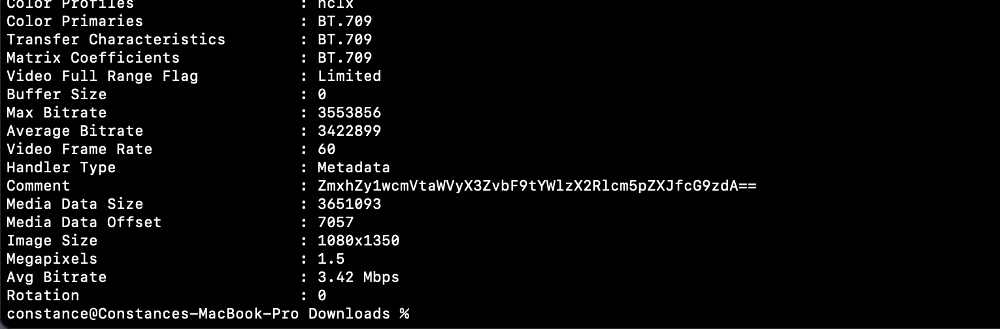
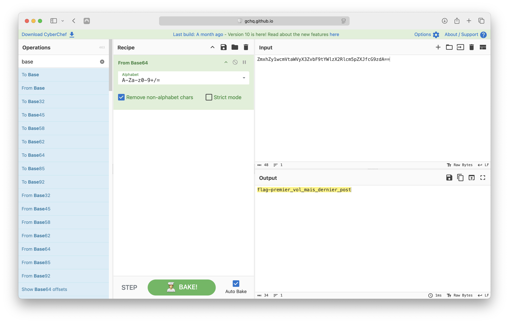

# Influenceur 4

## Write-up

Comme indiqué dans la description, il faut utiliser le post publié sur Discord pour ce challenge. Voici la vidéo :

Le flag est encodé en base64 et placé dans les commentaires des metadata de la vidéo.

Voici la string en question : `ZmxhZy1wcmVtaWVyX3ZvbF9tYWlzX2Rlcm5pZXJfcG9zdA==`

Un coup dans CyberChef et on obtient le flag :

## Flag

`flag-premier_vol_mais_dernier_post`
