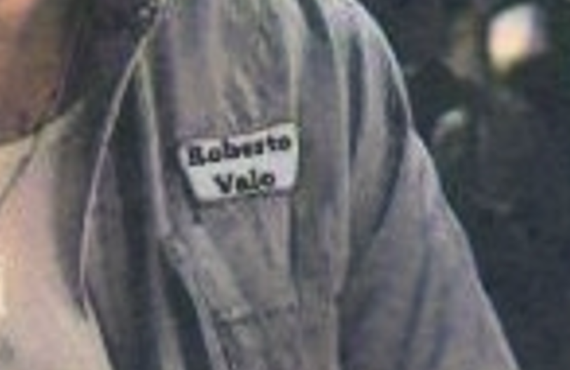

# Lendemain de veille

## Write-up

Si agrandit l'image, on peut voir que le nom de la personne sur son chandail, il est écrit Roberto Valo.

Si on recherche ce nom sur internet, il n'y a pas vraiment de résultats intéressants. Par contre, si on va directement sur Facebook, on peut trouver assez facilement un profil avec un homme qui a le même visage que celui sur la photo trouvée.

Sur la page d'accueil, il n'y a rien d'intéressant, mais si on va dans les vidéos, on trouve une vidéo de trois minutes. Ce n'est pas possible de trouver la ville à partir de cette vidéo, mais si on va dans les commentaires, on voit que Roberto dit qu'il fait souvent des vidéos de ce genre en donnant un user : @ValoRoberto

Avec un peu de déduction on peut comprendre que c'est un compte Youtube. Sur ce compte, il y a trois vidéos dont une qui est la même que celle sur Facebook. La première est également inutile, mais dans la deuxième, si on regarde bien, on peut voir cette pancarte :

Après une recherche rapide sur internet, on peut facilement trouver que c'est un magasin de meuble dans la ville de Recife !

## Flag

`flag-Recife`
