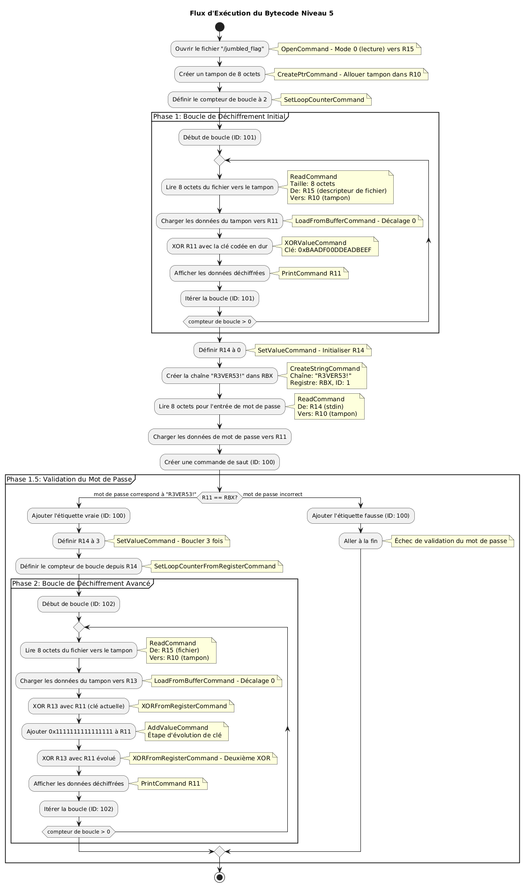
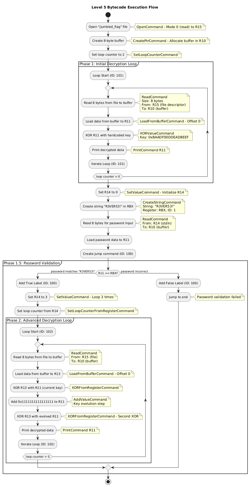

# Рилски Реверс (Rila Reverse) writeup:
# FR:

## Objectif
Le niveau 5 est un défi de rétro-ingénierie où vous devez analyser du bytecode fourni ainsi qu’un fichier de drapeau brouillé afin de reconstruire l’algorithme de déchiffrement. Contrairement aux niveaux précédents, vous n’avez pas accès à un interpréteur en cours d’exécution – vous devez désassembler manuellement le bytecode pour comprendre le processus de déchiffrement et récupérer le drapeau original.

## Mise en place du défi
On vous fournit :
- **Bytecode** : un programme compilé dans un langage assembleur personnalisé  
- **Fichier de drapeau brouillé** : `/jumbled_flag` contenant les données chiffrées  
- **Pas d’accès à un interpréteur** : il faut rétro-concevoir l’algorithme manuellement  

## Processus de rétro-ingénierie

### Étape 1 : Désassemblage du bytecode
Commencez par analyser le bytecode et identifier les instructions individuelles et leurs arguments.

### Étape 2 : Analyse du flot de contrôle
Identifiez les boucles, les branchements conditionnels et la structure générale du programme.

### Étape 3 : Reconstruction de l’algorithme
À partir des instructions et de leur ordre, reconstituez l’algorithme de déchiffrement.

### Étape 4 : Déchiffrement du flag
En utilisant l’algorithme reconstruit, déchiffrez à l'aide d'un script les données du flag brouillé.

## Analyse du bytecode

### Commandes disponibles
- **Print Command (0x99)** : Affiche le contenu du registre (ne fait en réalité rien)  
- **Create Jump Command (0x0)** : Crée des étiquettes de saut pour le flux de contrôle  
- **Open Command (0x1)** : Ouvre des fichiers  
- **Create Ptr Command (0x2)** : Alloue des pointeurs mémoire  
- **Read Command (0x3)** : Lit des données depuis des fichiers vers la mémoire  
- **Set Value Command (0x5)** : Définit les valeurs des registres  
- **Add Value Command (0x6)** : Effectue des opérations mathématiques sur les registres  
- **Jump Label Commands (0x7, 0x8)** : Cibles de saut conditionnel pour Vrai/Faux  
- **Compare Register Command (0x9)** : Compare des registres pour le branchement  
- **Loop Commands (0xA, 0xE, 0xF)** : Structures de contrôle de boucle  
- **XOR Commands (0xB, 0xBB)** : Opérations XOR avec des valeurs/registres  
- **Create String Command (0xC)** : Création et manipulation de chaînes de caractères  
- **Load From Buffer Command (0xD)** : Chargement de données depuis un tampon

## Désassemblage du bytecode

```
01 0d 2f6a756d626c65645f666c6167 02 0000 02 0600
↓
Open Command
  Filename: "/jumbled_flag"
  Mode: 0
  Result Register: R15

02 02 0800 02 0200
↓
Create Ptr Command
  Size: 8
  Result Register: R10

0a 02 0200
↓
Set Loop Counter Command
  Value: 2

0f 02 6500
↓
Loop Start Command
  ID: 101

03 02 0800 02 0600 02 0200
↓
Read Command
  Size: 8
  File Descriptor Location: R15
  Buffer Location: R10

0d 02 0200 02 0000 02 0300
↓
Load From Buffer Command
  Buffer Location: R10
  Offset: 0
  Register: R11

0b 08 efbeadde0df0adba 02 0300
↓
XOR Value Command
  Key: 0xBAADF00DDEADBEEF
  Register: R11

99 02 0300
↓
Print Command
  Register: R11

0e 02 6500
↓
Iterate Loop Command
  ID: 101

05 02 0000 02 0500
↓
Set Value Command
  Value: 0
  Register: R14

0c 08 5233564552353321 02 0100 02 0100
↓
Create String Command
  String: "R3VER53!"
  Register: RBX
  ID: 1

03 02 0800 02 0500 02 0200
↓
Read Command
  Size: 8
  File Descriptor Location: R14
  Buffer Location: R10

0d 02 0200 02 0000 02 0300
↓
Load From Buffer Command
  Buffer Location: R10
  Offset: 0
  Register: R11

00 02 6400
↓
Create Jump Command
  ID: 100

09 02 6400 02 0300 02 0100 02 0100
↓
Compare Register Command
  ID: 100
  Register 1: R11
  Register 2: RBX
  Condition: EQUAL

07 02 6400
↓
Add True Label Command
  ID: 100

05 02 0300 02 0500
↓
Set Value Command
  Value: 3
  Register: R14

aa 02 0500
↓
Set Loop Counter From Register Command
  Value: R14

0f 02 6600
↓
Loop Start Command
  ID: 102

03 02 0800 02 0600 02 0200
↓
Read Command
  Size: 8
  File Descriptor Location: R15
  Buffer Location: R10

0d 02 0200 02 0000 02 0400
↓
Load From Buffer Command
  Buffer Location: R10
  Offset: 0
  Register: R13

bb 02 0300 02 0400
↓
XOR From Register Command
  Key: R11
  Register: R13

06 08 1111111111111111 02 0300
↓
Add Value Command
  Value: 0x1111111111111111
  Register: R11

bb 02 0300 02 0400
↓
XOR From Register Command
  Key: R11
  Register: R13

99 02 0300
↓
Print Command
  Register: R11

0e 02 6600
↓
Iterate Loop Command
  ID: 102

08 02 6400
↓
Add False Label Command
  ID: 100
```

## Flot d’exécution


## Reconstruction manuelle de l’algorithme

### Vue d’ensemble
Le bytecode révèle trois grandes étapes :

1. **Étape 1** : déchiffrement XOR simple avec clé codée en dur (2 itérations)  
2. **Étape 2** : vérification du mot de passe  
3. **Étape 3** : déchiffrement double-XOR avec clé évolutive (3 itérations)  

### Étape 1 : Déchiffrement initial
**But** : déchiffrer les 16 premiers octets du drapeau avec une clé XOR statique.  

**Algorithme** :
```python
def step1_decrypt(jumbled_data):
    key = 0xBAADF00DDEADBEEF
    result = ""
    
    for i in range(2):  # Boucle 2 fois
        # Lire 8 octets du jumbled_flag (données stockées en big-endian)
        chunk = jumbled_data[i*8:(i+1)*8]
        data = int.from_bytes(chunk, 'big')
        
        # XOR avec la clé codée en dur
        decrypted = data ^ key
        
        # Conversion en chaîne (en gardant le big-endian pour la sortie)
        result += decrypted.to_bytes(8, 'big').decode('ascii', errors='ignore')
    
    return result
```
### Étape 2 : Validation du mot de passe

**Algorithme** :
```python
def validate_password(user_input):
    expected_password = "R3VER53!"
    return user_input == expected_password
```

### Étape 3 : Déchiffrement avancé

**But** : Déchiffrer les 24 octets restants en utilisant une clé évolutive avec une double opération XOR.

**Algorithme** :
```python
def step3_decrypt(jumbled_data, start_offset=16):
    # Clé initiale à partir du mot de passe (chaînes stockées en big-endian)
    key = int.from_bytes("R3VER53!".encode(), 'big')  # 0x5233564552353321
    key_increment = 0x1111111111111111
    result = ""
    
    for i in range(3):  # Boucle 3 fois
        # Lire 8 octets du jumbled_flag (données stockées en big-endian)
        chunk = jumbled_data[start_offset + i*8:start_offset + (i+1)*8]
        data = int.from_bytes(chunk, 'big')
        
        # Premier XOR avec la clé actuelle
        temp = data ^ key
        
        # Évolution de la clé
        key = (key + key_increment) & 0xFFFFFFFFFFFFFFFF
        
        # Second XOR avec la clé évoluée
        decrypted = temp ^ key
        
        # Conversion en chaîne (en gardant le big-endian pour la sortie)
        result += decrypted.to_bytes(8, 'big').decode('ascii', errors='ignore')
    
    return result
```

### Analyse de l’évolution de la clé

L’évolution de la clé suit un schéma prévisible :

  - **Clé initiale** : `0x5233564552353321` ("R3VER53!" en 64-bit big-endian)
  - **Itération 1** : Clé = `0x5233564552353321`
  - **Itération 2** : Clé = `0x5233564552353321 + 0x1111111111111111 = 0x6344675663464432`
  - **Itération 3** : Clé = `0x6344675663464432 + 0x1111111111111111 = 0x7455786774575543`

### Algorithme combiné

**Processus complet de déchiffrement**:
```python
def decrypt_jumbled_flag(jumbled_file_path):
    with open(jumbled_file_path, 'rb') as f:
        data = f.read()
    
    # Étape 1 : Déchiffrement initial (premiers 16 octets)
    step1_result = step1_decrypt(data[:16])

    # Étape 2 : Validation du mot de passe
    if not validate_password(input()):
        raise ValueError("Mot de passe invalide")

    # Étape 3 : Déchiffrement avancé (24 octets restants)
    step3_result = step3_decrypt(data, start_offset=16)

    # Combiner les résultats
    flag = step1_result + step3_result
    return flag.strip('\x00')  # Supprimer le padding nul
```

## Flag final
`flag-70aa714c334f42288f253ab2da46a12345a`

# EN:
## Objective
Level 5 is a reverse engineering challenge where you must analyze provided bytecode and a jumbled flag file to reconstruct the decryption algorithm. Unlike previous levels, you don't have access to a running interpreter - you must manually reverse the bytecode to understand the decryption process and recover the original flag.

## Challenge Setup
You are provided with:
- **Bytecode**: A compiled program in the custom assembly language
- **Jumbled Flag File**: `/jumbled_flag` containing encrypted data
- **No Interpreter Access**: Must reverse engineer the algorithm manually

## Reverse Engineering Process

### Step 1: Bytecode Disassembly
First, we need to parse the bytecode and identify the individual commands and their arguments.

### Step 2: Control Flow Analysis
Identify loops, conditional branches, and the overall program structure.

### Step 3: Reconstructing the Algorithm
Based on the commands and their sequence, we can piece together the decryption algorithm.

### Step 4: Decrypting the Flag
Using the reconstructed algorithm, we can decrypt the jumbled flag data using a script.

## Bytecode Analysis

### Available Commands
- **Print Command (0x99)**: Prints the register content (Does not do actually anything)
- **Create Jump Command (0x0)**: Creates jump labels for control flow
- **Open Command (0x1)**: Opens files   
- **Create Ptr Command (0x2)**: Allocates memory pointers
- **Read Command (0x3)**: Reads data from files into memory
- **Set Value Command (0x5)**: Sets register values
- **Add Value Command (0x6)**: Mathematical operations on registers
- **Jump Label Commands (0x7, 0x8)**: Conditional jump targets for True/False
- **Compare Register Command (0x9)**: Register comparison for branching
- **Loop Commands (0xA, 0xE, 0xF)**: Loop control structures
- **XOR Commands (0xB, 0xBB)**: XOR operations with values/registers
- **Create String Command (0xC)**: String creation and manipulation
- **Load From Buffer Command (0xD)**: Buffer data loading


## Bytecode Disassembly

### Complete Bytecode:
```
010d2f6a756d626c65645f666c6167020000020600020208000202000a0202000f026500030208000206000202000d0202000200000203000b08efbeadde0df0adba020300990203000e026500050200000205000c085233564552353321020100020100030208000205000202000d02020002000002030000026400090264000203000201000201000702640005020300020500aa0205000f026600030208000206000202000d020200020000020400bb02030002040006081111111111111111020300bb020300020400990203000e02660008026400
```

### Bytecode split into commands:
```
01 0d 2f6a756d626c65645f666c6167 02 0000 02 0600
↓
Open Command
  Filename: "/jumbled_flag"
  Mode: 0
  Result Register: R15

02 02 0800 02 0200
↓
Create Ptr Command
  Size: 8
  Result Register: R10

0a 02 0200
↓
Set Loop Counter Command
  Value: 2

0f 02 6500
↓
Loop Start Command
  ID: 101

03 02 0800 02 0600 02 0200
↓
Read Command
  Size: 8
  File Descriptor Location: R15
  Buffer Location: R10

0d 02 0200 02 0000 02 0300
↓
Load From Buffer Command
  Buffer Location: R10
  Offset: 0
  Register: R11

0b 08 efbeadde0df0adba 02 0300
↓
XOR Value Command
  Key: 0xBAADF00DDEADBEEF
  Register: R11

99 02 0300
↓
Print Command
  Register: R11

0e 02 6500
↓
Iterate Loop Command
  ID: 101

05 02 0000 02 0500
↓
Set Value Command
  Value: 0
  Register: R14

0c 08 5233564552353321 02 0100 02 0100
↓
Create String Command
  String: "R3VER53!"
  Register: RBX
  ID: 1

03 02 0800 02 0500 02 0200
↓
Read Command
  Size: 8
  File Descriptor Location: R14
  Buffer Location: R10

0d 02 0200 02 0000 02 0300
↓
Load From Buffer Command
  Buffer Location: R10
  Offset: 0
  Register: R11

00 02 6400
↓
Create Jump Command
  ID: 100

09 02 6400 02 0300 02 0100 02 0100
↓
Compare Register Command
  ID: 100
  Register 1: R11
  Register 2: RBX
  Condition: EQUAL

07 02 6400
↓
Add True Label Command
  ID: 100

05 02 0300 02 0500
↓
Set Value Command
  Value: 3
  Register: R14

aa 02 0500
↓
Set Loop Counter From Register Command
  Value: R14

0f 02 6600
↓
Loop Start Command
  ID: 102

03 02 0800 02 0600 02 0200
↓
Read Command
  Size: 8
  File Descriptor Location: R15
  Buffer Location: R10

0d 02 0200 02 0000 02 0400
↓
Load From Buffer Command
  Buffer Location: R10
  Offset: 0
  Register: R13

bb 02 0300 02 0400
↓
XOR From Register Command
  Key: R11
  Register: R13

06 08 1111111111111111 02 0300
↓
Add Value Command
  Value: 0x1111111111111111
  Register: R11

bb 02 0300 02 0400
↓
XOR From Register Command
  Key: R11
  Register: R13

99 02 0300
↓
Print Command
  Register: R11

0e 02 6600
↓
Iterate Loop Command
  ID: 102

08 02 6400
↓
Add False Label Command
  ID: 100
```

### Execution Flow:


## Manual Algorithm Reconstruction

Through bytecode analysis, we can reconstruct the decryption algorithm:

### Algorithm Overview

The bytecode reveals a three big steps:

1. **Step 1**: Simple XOR decryption with hardcoded key (2 iterations)
2. **Step 2**: Password validation checkpoint
3. **Step 3**: dual-XOR decryption with evolving key (3 iterations)

### Step 1: Initial Decryption

**Purpose**: Decrypt the first 16 bytes of the flag using a static XOR key.

**Algorithm**:
```python
def step1_decrypt(jumbled_data):
    key = 0xBAADF00DDEADBEEF
    result = ""
    
    for i in range(2):  # Loop 2 times
        # Read 8 bytes from jumbled_flag (data stored in big-endian)
        chunk = jumbled_data[i*8:(i+1)*8]
        data = int.from_bytes(chunk, 'big')
        
        # XOR with hardcoded key
        decrypted = data ^ key
        
        # Convert back to string (maintaining big-endian for output)
        result += decrypted.to_bytes(8, 'big').decode('ascii', errors='ignore')
    
    return result
```

### Step 2: Password Validation

**Algorithm**:
```python
def validate_password(user_input):
    expected_password = "R3VER53!"
    return user_input == expected_password
```

### Step 3: Advanced Decryption

**Purpose**: Decrypt the remaining 24 bytes using an evolving key with dual-XOR operations.

**Algorithm**:
```python
def step3_decrypt(jumbled_data, start_offset=16):
    # Initial key from password (strings are stored in big-endian)
    key = int.from_bytes("R3VER53!".encode(), 'big')  # 0x5233564552353321
    key_increment = 0x1111111111111111
    result = ""
    
    for i in range(3):  # Loop 3 times
        # Read 8 bytes from jumbled_flag (data stored in big-endian)
        chunk = jumbled_data[start_offset + i*8:start_offset + (i+1)*8]
        data = int.from_bytes(chunk, 'big')
        
        # First XOR with current key
        temp = data ^ key
        
        # Evolve the key
        key = (key + key_increment) & 0xFFFFFFFFFFFFFFFF
        
        # Second XOR with evolved key
        decrypted = temp ^ key
        
        # Convert back to string (maintaining big-endian for output)
        result += decrypted.to_bytes(8, 'big').decode('ascii', errors='ignore')
    
    return result
```

### Key Evolution Analysis

The key evolution follows a predictable pattern:
- **Initial Key**: `0x5233564552353321` ("R3VER53!" as 64-bit big-endian)
- **Iteration 1**: Key = `0x5233564552353321`
- **Iteration 2**: Key = `0x5233564552353321 + 0x1111111111111111 = 0x6344675663464432`
- **Iteration 3**: Key = `0x6344675663464432 + 0x1111111111111111 = 0x7455786774575543`

### Combined Algorithm

**Complete Decryption Process**:
```python
def decrypt_jumbled_flag(jumbled_file_path):
    with open(jumbled_file_path, 'rb') as f:
        data = f.read()
    
    # Step 1: Initial decryption (first 16 bytes)
    step1_result = step1_decrypt(data[:16])

    # Step 2: Password validation
    if not validate_password(input()):
        raise ValueError("Invalid password")

    # Step 3: Advanced decryption (remaining 24 bytes)
    step3_result = step3_decrypt(data, start_offset=16)

    # Combine results
    flag = step1_result + step3_result
    return flag.strip('\x00')  # Remove null padding
```
## Final Flag
`flag-70aa714c334f42288f253ab2da46a12345a`