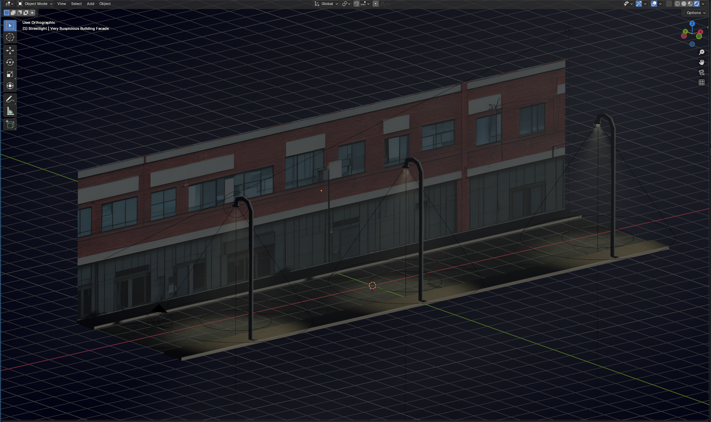

# Nuit blanche

## Write-up

Le défi nous donne un projet Blender (.blend), la description mentionne une facade d'édifice potentiellement intéressante.

Lorsqu'on ouvre la scène, on voit une rue, des trottoirs, quelques lampadaires et une facade d'édifice.

On peut rentrer en mode "rendu" pour voir la scène telle qu'elle est.

Dans le projet, on voit que le nom de l'objet représentant la facade s'appelle "Very Suspicious Building Facade", ce qui nous pousse à investiguer.

La description du défi contient les mots "très normale" en italique. On peut essayer de visualiser les normales.

En affichant les normales et en jouant avec les paramètres de visualisation, nous pouvons voir que plusieurs faces de l'édifice ont des normales inversées, ce qui dessine notre flag.

## Flag

`flag-bad3d`
