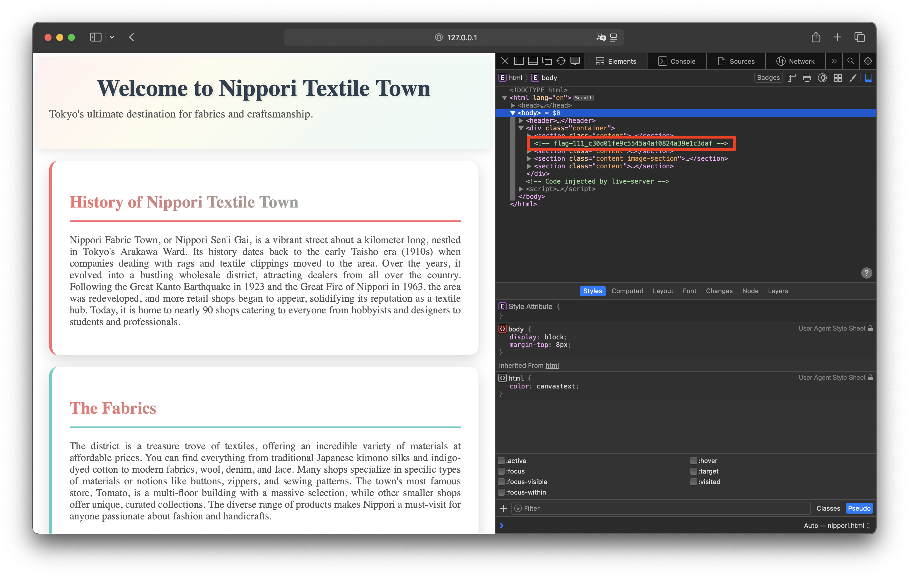

# Nippori

Cette track se base sur les vulnérabilités web très faciles, afin de rendre tout ça accesible aux débutants.

## Flag 1

Le flag est dans les commentaires du code HTML :



```flag-111_c30d01fe9c5545a4af0824a39e1c3daf```


# Flag 2

Le flag est dans les commentaires du code CSS :


```flag-222_606bee78309046148b4b67cb258cdb37```

# Flag 3

Le flag est dans le /Flag.txt (on peut le trouver grâce au /robot.txt ou bien grâce à un fuzzer de directories) :


```flag-333_40b5b161a9ea4bf2bfff1eaeccfd6499```

# Flag 4

Le flag est dans les images (c'est aussi le background image, mais il y a un fond blanc par dessus) :


```flag-444_8da56afdc8514580b4b7e72e9e4cc4f7```
